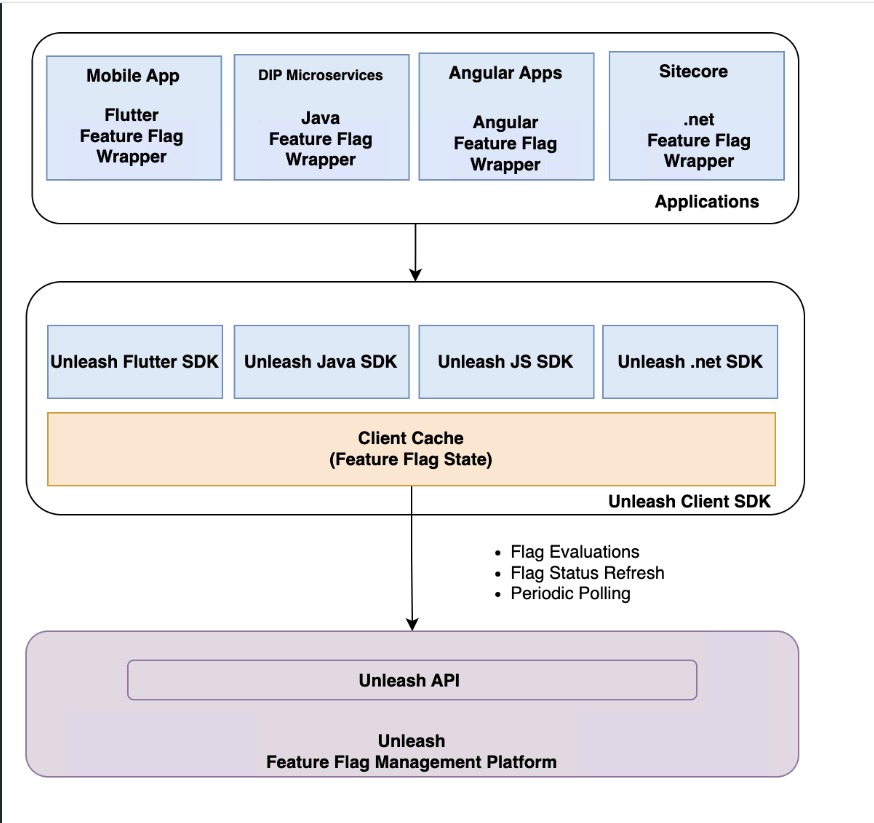

# [Project : Automyze Decomissioning]

Unleash is a feature management platform designed for progressive delivery and controlled feature rollouts. It enables teams to:
    * Toggle features on/off without redeploying code.
    * Perform gradual rollouts, A/B testing, and targeted releases.
    * Control feature availability based on:
        * Session attributes
        * Custom strategies (like time-based toggles, geo-location, etc.)

## Core Benefits:
* Improved deployment safety with gradual rollouts.
* Reduced risk through targeted exposure.
* Decouples deployment from feature release.
* Central dashboard to manage and monitor feature toggles.

# [GitHub Repository Name : dip-lib-instrument-feature-flags]

## Overview

The dip-lib-instrument-feature-flags library is a reusable Java wrapper designed to simplify feature flag evaluation in microservices by integrating with the Unleash SDK. It encapsulates the complexity of interacting with the Unleash feature flag system and provides a consistent, lightweight interface for enabling or disabling features dynamically across distributed services.
This library enables other microservices to:
    * Query feature flag status using simple, abstracted methods.
    * Perform flag and context-based flag evaluation (e.g., userId, IP, session, custom context-fields).
    * Log evaluation events and failures uniformly.
    * Ensure feature toggling is decoupled from business logic

## What problem does unleash solves ?

In modern microservices-based applications, releasing new functionality can be risky because deploying code and exposing features to users happen simultaneously. If an issue is discovered after deployment, teams often need to perform rollbacks, which can be time-consuming and disruptive. Unleash solves this problem by decoupling deployment from feature release.

Key Problems Addressed by Unleash

1.⁠ ⁠Reducing Deployment Risk Traditionally, new features become available as soon as code is deployed. If a feature contains bugs or causes performance issues, the entire deployment may need to be rolled back. Unleash allows teams to keep new features disabled after deployment and enable them only when they are ready, significantly reducing release risk.

2.⁠ ⁠Enabling Gradual and Controlled Rollouts Releasing a feature to 100% of users at once can expose the entire customer base to potential issues. Unleash enables gradual rollouts, allowing teams to release features to a small percentage of users first, monitor behavior, and progressively increase exposure.

3.⁠ ⁠Supporting Targeted Feature Availability Different users often require different experiences. Unleash allows teams to enable features based on user attributes, session data, country, IP address, environment, customer segments, or custom business rules, enabling personalized and controlled releases.

4.⁠ ⁠Accelerating Experimentation and Validation Organizations often need to validate new ideas before a full launch. Unleash supports A/B testing and canary releases by selectively exposing features to specific user groups, helping teams gather feedback and make data-driven decisions.

5.⁠ ⁠Eliminating Frequent Code Changes for Feature Control Without a feature management platform, enabling or disabling functionality often requires code modifications and redeployments. Unleash provides centralized feature control, allowing teams to manage feature availability dynamically without changing application code.

6.⁠ ⁠Improving Operational Resilience If a newly released feature causes production issues, teams can immediately disable the feature through Unleash without triggering an application rollback. This acts as a safety switch and minimizes customer impact.

How dip-lib-instrument-feature-flags Helps :

While Unleash provides the feature management platform, the dip-lib-instrument-feature-flags library simplifies integration with Unleash across microservices by:

    * Abstracting direct interactions with the Unleash SDK.
    * Providing a standardized API for feature flag evaluation.
    * Supporting context-aware evaluations (userId, session, IP, custom context fields).
    * Centralizing logging and error handling.
    * Keeping feature toggle logic separate from business logic.
    * Ensuring consistency across distributed services.

## Architecture

## Technology Stack

•⁠  ⁠[Java]
•⁠  ⁠[Common-Library] published as an artifact library in aacom
•⁠  ⁠[Postgres] database used by unleash internally
•⁠  ⁠[Azure]
•⁠  ⁠[Junit/Mockito]

## Steps to use

* Use dip-lib-instrument-feature-flags 1.0.5+ version, import in build.gradle file. 
implementation 'com.theaa.dip:instrument-feature-flags:1.0.5+'
* Add @EnableFeatureFlags annotation in the main application.
* Autowire the FeatureFlagUtils class in service & use isFeatureEnabled(“flagName”), isFeatureEnabled(“flagName”,context) as per use case. Also add the context in the Unleash UI for context-field matching. Note : userId, ipAddress, sessionId are default names for context-field as defined in dip-lib-instrument-flags, any other custom context-fields can be passed in the isFeatureEnabled() & configured from Unleash UI.
* Unleash url, token as per environment, toggle interval & app-name for checking feature-flag usage are configured as a part of ssm parameters in AWS System Manager.

References : Detailed documentations were prepared along with use cases.

## Testing

Junit Test cases covering various scenarios followed by qa validation and regression testing.

## Requisites and Challenges

Implementing Unleash Enterprise required both technical and organizational considerations. One of the primary prerequisites was procuring and onboarding a hybrid Unleash Enterprise license that could support feature flag management across multiple environments and services.

Key Challenges : 

1. Context-Aware Flag Evaluation
Challenge

Different teams want to evaluate flags using different attributes:

- userId
- customerId
- sessionId
- IP address
- region
- customer type
- journey type
- custom attributes

Customization : Build a generic context builder :

FeatureContext context = FeatureContext.builder()
.userId(userId)
.region(region)
.customerType(customerType)
.addProperty("journey", journey)
.build();

How to Handle :
* Standardize context creation
* Validate mandatory fields
* Prevent teams from sending arbitrary context structures
* Mask sensitive fields

2. Performance & Caching
Challenge

A common misconception is that every flag check calls Unleash.

In reality, SDKs cache flags locally, but:

- Cache refresh intervals need tuning
- Stale configurations may exist
- Large numbers of flags increase memory footprint

Customization : Expose wrapper configurations : YAML :

feature-flags: flag_name
refresh-interval: 10s
cache-enabled: true

How to Handle :
* Tune refresh intervals
* Add local fallback cache
* Prevent excessive polling

3. Feature Flag Variants & A/B Testing
Challenge

Simple booleans are easy. Variants introduce complexity :

- CHECKOUT_V1
- CHECKOUT_V2
- CHECKOUT_V3

Customization : Strongly typed variant support :

CheckoutVariant variant =
featureFlagService.getVariant("checkout");

How to Handle :
* Enum-based variants
* Sticky user allocation
* Traffic distribution monitoring

4. Wrapper Evolution & SDK Compatibility
Challenge

Wrapper library sits between services and Unleash.

When Unleash releases:

- New strategies
- New variants
- New context fields

wrapper may hide those capabilities.

How to Handle :
* Design extension points
* Avoid over-abstraction
* Maintain backward compatibility

5. Multi-Environment Consistency
Challenge

Flags differ across:

- DEV
- QA
- UAT
- PROD

Teams often forget to synchronize configurations.

Customization : Provide environment validation APIs : validateFlagParity();

How to Handle :
* Missing configuration detection
* Environment drift reporting
* Automated promotion pipelines

6. Observability
Challenge

Teams don't know:

- Which flags are being used
- How often they're evaluated
- Which strategy matched

Customization : Add Micrometer metrics :

 feature_flag_evaluation_total
 feature_flag_enabled_total
 feature_flag_fallback_total

How to Handle :
* Prometheus metrics
* CloudWatch dashboards
* Grafana visualizations
* Structured logging

7. Failure Resiliency
Challenge

What happens when :

- Unleash server is unavailable?
- Network connectivity drops?
- Configuration refresh fails?

Customization : wrapper must continue operating :

featureFlagService.isEnabled(
"new-checkout",
context,
false
); where false becomes the fallback.

How to Handle : 
* Offline mode support
* Default values
* Circuit breakers
* Graceful degradation

Another important aspect was implementing role-based access control, as feature flag management needed to be restricted to a limited set of authorized users across multiple teams. This required defining ownership, access boundaries, approval processes, and operational guidelines to ensure that feature toggles were managed securely and consistently.

* How did caching work?

The Unleash SDK maintained an in-memory cache of feature-toggle definitions within each microservice instance.

When a feature flag was evaluated, the service generally read the toggle configuration from local memory rather than making a database or network call for every request. This made flag evaluation very fast and avoided introducing runtime dependency on the Unleash server for each business request.

The cache typically contained:

- Feature-toggle names
- Enabled or disabled status
- Activation strategies
- Constraints and rollout configuration
- Context-dependent evaluation information, where applicable
The Java wrapper was responsible for creating and configuring the SDK client consistently across services.

* How was the cache refreshed?

The cache was refreshed asynchronously by the SDK at a configured polling interval. During refresh, the client contacted the Unleash server and retrieved the latest feature-toggle configuration.

A typical flow was:

- The microservice starts and initializes the Unleash client.
- The client loads the initial feature-toggle configuration.
- The configuration is stored in local memory.
- A background process periodically polls the Unleash server.
- The in-memory cache is updated when new configuration is received.
- Feature evaluations continue to use the latest available local configuration.
This design ensured that feature evaluation was not dependent on a remote call during every request.

If the Unleash server temporarily became unavailable, the service could continue using the last successfully retrieved configuration, depending on the SDK and fallback configuration. This provided resilience, although the service would not immediately receive newly changed flags until connectivity was restored.

* Were there latency issues because of the additional layer?

The wrapper itself did not introduce a significant latency impact because it was mainly an initialization and configuration layer around the SDK. It did not make a network call for every feature-flag evaluation.

The Unleash Java SDK optimizes for high-speed, thread-safe reads by employing immutable data structures combined with an AtomicReference. When the background thread fetches updated toggle configurations from the server, it constructs a entirely new, immutable representation of the state. Once constructed, it performs an atomic swap by updating the AtomicReference to point to the new configuration. 

Because the runtime code only ever reads from the reference without modifying the underlying map, we avoid expensive locking mechanisms and eliminate the risk of ConcurrentModificationException entirely. This ensures that feature-flag evaluation remains an ultra-low latency, thread-safe operation, even under high concurrent load.